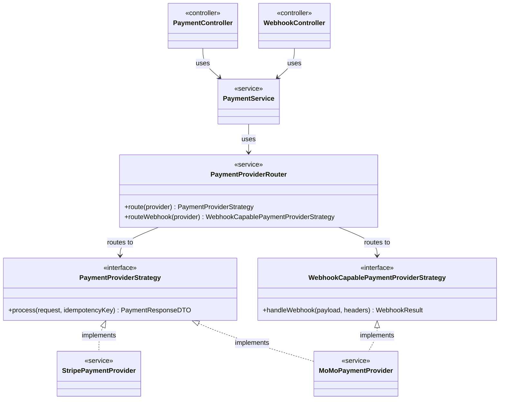

# Payment API - Class Diagram

## Overview
This class diagram focuses on the key design patterns used in the Payment API system, particularly the **Strategy Pattern**, **Router Pattern**, and **Service Layer Pattern**.

## Class Diagram

